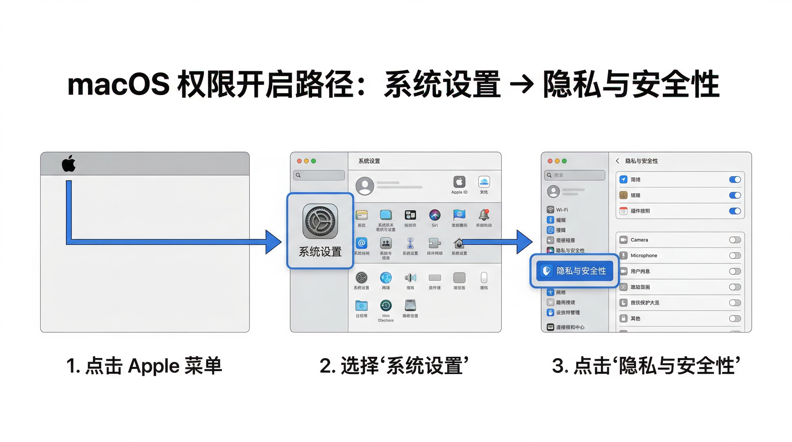

# OpenClaw macOS 一键安装（从零到可用）

> 适用：**macOS 为主**（Linux 同样可用）。  
> Windows 用户强烈建议走 **WSL2**：见 [`docs/windows-wsl2.md`](docs/windows-wsl2.md)。

你将获得：
- 一条命令完成安装 + 引导（**命令级一键，最稳**）
- 可复制粘贴的验收命令（`doctor/status/health`）
- 网络/代理不通时的先验收方案（避免反复失败）
- 远端常驻 Gateway + 本地远程使用（可选）：[`docs/remote-gateway.md`](docs/remote-gateway.md)

---

## 0) 安装前 30 秒自检（强烈建议先做）

### 0.1 Node 版本（硬要求）
OpenClaw 要求 **Node.js ≥ 22**：

```bash
node -v
```

如果版本 < 22，请先升级 Node（推荐用 fnm/nvm 管理版本）。

### 0.2 网络验收（公司/校园/国内网络必做）
先确认能访问官方安装入口和 npm：

```bash
curl -I https://openclaw.ai
npm ping
```

通过标准：
- `curl` 返回 200/301/302 等（不要超时）
- `npm ping` 返回 `pong`

不通过请先处理：[`docs/proxy.md`](docs/proxy.md)

---

## 1) 一键安装（复制粘贴区域）

<table>
  <tr>
    <td width="50%"><b>macOS / Linux</b></td>
    <td width="50%"><b>说明</b></td>
  </tr>
  <tr>
    <td>

```bash
curl -fsSL https://raw.githubusercontent.com/EvanTop/openclaw-remote-install-kit/main/scripts/openclaw-quick-install.sh | bash
```

  </td>
    <td>
      <ul>
        <li>脚本会先做环境预检（Node 版本、网络提示）</li>
        <li>随后调用 <b>OpenClaw 官方安装器</b>（透明、可信）</li>
        <li>并执行 <code>openclaw onboard --install-daemon</code>（安装守护进程，便于常驻）</li>
        <li>最后跑一次基础健康检查（<code>doctor/status/health</code>）</li>
      </ul>
      <p><i>如果你在公司/校园网，建议先完成第 0.2 步的网络验收。</i></p>
    </td>
  </tr>
</table>

---

## 2) 安装后验收（必须做）

复制粘贴运行：

```bash
openclaw doctor
openclaw status
openclaw health
```

打开控制面板：

```bash
openclaw dashboard
```

---

## 3) macOS 权限开启（保姆级图示）

> 仅当你希望 OpenClaw 在 macOS 上具备更强的设备能力（如录屏、控制、麦克风、语音等）才需要。  
> 如果你只用 WebChat/消息渠道对话，通常不需要额外权限。

### 3.1 进入权限入口（必看）

**路径：系统设置 → 隐私与安全性**



### 3.2 常见需要开启的权限（按 OpenClaw 提示为准）

> 建议：当 OpenClaw 提示“缺少权限”时，优先来这里逐项对照。


通常会用到（不同版本 macOS 文案略有差异）：
- **辅助功能**（让应用能控制你的电脑）
- **自动化**（允许对其他应用执行自动化操作）
- **屏幕录制**（截屏/录屏/读取屏幕内容）
- **麦克风**（语音输入）
- **语音识别**（语音相关能力）
- **通知**（桌面通知）

### 3.3 示例 1：开启「辅助功能」权限（控制电脑）


操作要点：
1. 进入 **隐私与安全性 → 辅助功能**
2. 点击 **+** 添加（或在列表里找到）
3. 选择 **OpenClaw**（如果没出现，就先选择你运行它的载体，比如 **Terminal/你的终端应用**）
4. 打开开关后，**退出并重开相关应用**（Terminal/OpenClaw）

### 3.4 示例 2：开启「屏幕录制」权限（截图/录屏/读取屏幕）


操作要点：
1. 进入 **隐私与安全性 → 屏幕录制**
2. 勾选/开启 **OpenClaw**（以及你实际使用的浏览器如 Chrome（可选））
3. 开启后通常需要 **退出并重新打开应用** 才会生效

---

## 4) 常见问题（快速修）

### 4.1 安装后提示 `openclaw: command not found`
通常是全局 npm 的 bin 目录不在 PATH。

当前终端临时修复：

```bash
export PATH="$(npm prefix -g)/bin:$PATH"
openclaw --version
```

如果好了，把这行写入你的 `~/.zshrc` 或 `~/.bashrc`，然后重开终端。

更多见：[`docs/faq.md#openclaw-not-found`](docs/faq.md#openclaw-not-found)

### 4.2 Node 版本太低（< 22）
见：[`docs/faq.md#node-too-old`](docs/faq.md#node-too-old)

### 4.3 网络/代理导致安装失败
先不要反复重装，先跑网络验收：

```bash
curl -I https://openclaw.ai
npm ping
```

不通过见：[`docs/proxy.md`](docs/proxy.md)

### 4.4 远程连接 / 远端常驻 Gateway
见：[`docs/remote-gateway.md`](docs/remote-gateway.md)

---

## 5) 目录说明（仓库包含什么）

- `scripts/openclaw-quick-install.sh`：macOS/Linux 一键安装脚本
- `docs/proxy.md`：代理与网络排查（先验收再安装）
- `docs/windows-wsl2.md`：Windows 走 WSL2 的推荐安装流程
- `docs/remote-gateway.md`：远端常驻 Gateway + 远程访问（SSH/Tailscale 思路）
- `docs/faq.md`：常见问题
- `images/`：macOS 权限开启图示

---

## 官方参考（权威）

- 安装：https://docs.openclaw.ai/zh-CN/install  
- 远程访问：https://docs.openclaw.ai/gateway/remote  
- 项目主页：https://github.com/openclaw/openclaw
